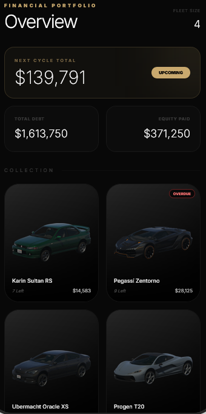
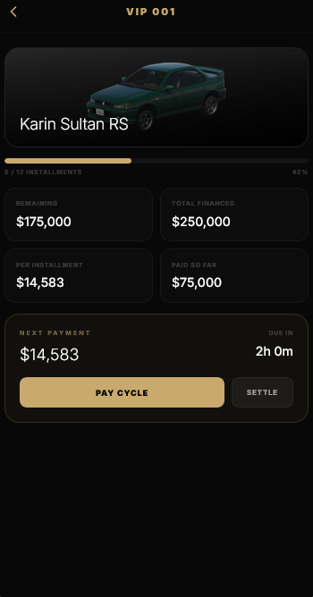

# Giga Scripts - Finance App for JG Dealerships


`gs-app-finance-jg` is a premium smartphone finance app for FiveM, based on [dyceaus/jg-dealerfinance](https://github.com/dyceaus/jg-dealerfinance) and rebuilt by **Giga Scripts** for **jg-dealerships v2**.

## Features

- **Finance Management**: Complete overview of active loans, per-vehicle details, installment payment, and full payoff.
- **Multi-Phone Architecture**: Bridge-based integration for `lb-phone`, `yseries`, `yphone`, `17mov_Phone`, and `gksphone`.
- **Framework Compatibility**: Supports Qbox, QBCore, and ESX.
- **Resilient Image Resolution**: Vehicle images fallback through multiple sources to avoid broken cards.
- **Localization and Formatting**: EN/PT-BR with locale-driven number/currency formatting via `ui_number_locale`.
- **Premium UI**: Dark, high-contrast interface tuned for in-game phone readability.
- **Store Assets Included**: Ready `lb-phone` app-store screenshots.

## Screenshots

<table width="100%">
  <tr>
    <td width="50%" align="center">
      
      <br>
      <b>Homepage</b>
    </td>
    <td width="50%" align="center">
      
      <br>
      <b>Vehicle Details</b>
    </td>
  </tr>
</table>

## Compatibility

### Supported Phones

Auto-detection priority is defined in `bridge/options/integrations.lua` (first started supported phone wins):

| Priority | Phone Resource | App Registration | Notifications |
|---|---|---|---|
| 1 | `lb-phone` | `AddCustomApp` | Client export |
| 2 | `yseries` | `AddCustomApp` | Server export via bridge event |
| 3 | `yphone` | `AddCustomApp` | Server export via bridge event |
| 4 | `17mov_Phone` | `AddApplication` | Client export |
| 5 | `gksphone` | `AddCustomApp` | Client export |

### Supported Frameworks

Framework resolution happens in `framework.lua` (`Config.Framework` defaults to `auto` and then merges with `jg-dealerships` config):

| Framework | Supported | Vehicles Table | Player Identifier |
|---|---|---|---|
| Qbox | Yes | `player_vehicles` | `citizenid` |
| QBCore | Yes | `player_vehicles` | `citizenid` |
| ESX | Yes | `owned_vehicles` | `owner` |

## Requirements

- [jg-dealerships](https://github.com/JoeSzymkowiczFiveworx/jg-dealerships) v2 (required)
  - This resource reads `jg-dealerships` runtime config export in `framework.lua`; outdated versions can break framework/payment settings.
  - For owned dealerships, this app needs the `addDealershipBalance` server export added to `jg-dealerships` — see [Owned Dealership Payments](#owned-dealership-payments).
- [ox_lib](https://github.com/overextended/ox_lib) (required)
- [oxmysql](https://github.com/overextended/oxmysql) (required)
- One supported phone resource running

> No SQL import is required for this resource.

## Owned Dealership Payments

When a financed vehicle belongs to an **owned** dealership (`dealership_locations.type = 'owned'`), each installment/payoff made through the app must credit that dealership's account.

`jg-dealerships` keeps the dealership balance in an **in-memory cache** and persists it back to the database on its own schedule. Writing the `dealership_locations.balance` column directly therefore does not work reliably — the cache stays stale and can overwrite your update on the next save, so the funds appear to never arrive. The app must credit the balance through `jg-dealerships` itself, using the same code path the showroom purchase uses (`DealershipBalance.Server.Add`).

### Required setup in `jg-dealerships`

`jg-dealerships` does not expose `DealershipBalance` to other resources, so add a small export. The file `server/sv-purchase.lua` is listed in the resource's `escrow_ignore`, so it is safe to edit even on the escrowed build.

Append this to the bottom of `jg-dealerships/server/sv-purchase.lua`:

```lua
---Credit an owned dealership's balance (used by gs-app-finance-jg).
---@param dealershipId string
---@param amount number
---@return boolean success
exports("addDealershipBalance", function(dealershipId, amount)
  if type(dealershipId) ~= "string" then return false end
  amount = tonumber(amount)
  if not amount or amount <= 0 then return false end

  DealershipBalance.Server.Add(dealershipId, amount)
  return true
end)
```

Restart `jg-dealerships` after the edit, then `gs-app-finance-jg`. No change is needed in this app's config — `server.lua` calls `exports['jg-dealerships']:addDealershipBalance(...)` automatically for owned dealerships.

> If you skip this step, payments still debit the customer and clear the loan, but the owned dealership account will not be credited (you will see an export-not-found error in the server console).

## Installation (Quick Start)

1. Place `gs-app-finance-jg` under your server resources.
2. Ensure dependencies and your selected phone start before this app.
3. Add `ensure gs-app-finance-jg` to your server config.

Example start order:

```cfg
ensure oxmysql
ensure ox_lib
ensure jg-dealerships
ensure lb-phone ; or yseries / yphone / 17mov_Phone / gksphone
ensure gs-app-finance-jg
```

## Configuration

Main settings in `config.lua`:

```lua
Config.Framework = 'auto'
Config.FinancePaymentInterval = 3 -- fallback (hours)
Config.AppIdentifier = 'gs-app-finance-jg'
Config.AppName = 'Giga Cred'
Config.AppDescription = locale('app_description')
Config.AppDeveloper = 'Giga Scripts'
```

Notes:

- `Config.Framework` defaults to `auto`; `framework.lua` merges runtime values from `jg-dealerships`.
- `Config.FinancePaymentInterval` fallback keeps timer math safe if dealer config export is unavailable.

## Localization

Set this key first in each active locale file:

- `ui_number_locale` (example: `en-US`, `pt-BR`)

Locale files:

- `locales/en.json`
- `locales/pt-br.json`

`ui_number_locale` controls separators and currency formatting in the UI.

## Vehicle Images

Image fallback chain used by the UI:

1. `https://cfx-nui-jg-advancedgarages/vehicle_images/{spawn}.png`
2. `https://cfx-nui-jg-dealerships/vehicle_images/{spawn}.png`
3. `https://docs.fivem.net/vehicles/{spawn}.webp`

If all fail, the app uses an internal gradient fallback.

## UI Build and Store Screenshots

For UI/source changes:

```bash
cd ui
npm install
npm run build
```

Build output is served from `ui/dist/`.

`lb-phone` store screenshots:

- Source files: `ui/public/store/screenshot-1.png` and `ui/public/store/screenshot-2.png`
- Build copies to: `ui/dist/store/`
- If placeholders persist, restart both `gs-app-finance-jg` and `lb-phone`

## Troubleshooting

| Problem | What to check |
|---|---|
| App not visible | Ensure phone + `jg-dealerships` start before `gs-app-finance-jg` |
| Payment fails unexpectedly | Check server console, framework detection, and finance data rows |
| Wrong number/currency format | Verify `ui_number_locale` in the active locale file |
| Vehicle image missing | Verify spawn naming and JG image configuration |

## Testing Checklist

- [ ] Open app and confirm financed vehicles load
- [ ] Verify installment payment success path
- [ ] Verify full payoff success path
- [ ] Verify payment-failure notification path
- [ ] Verify locale formatting (`ui_number_locale`) for expected separators/symbols
- [ ] Verify vehicle image fallback behavior
- [ ] Verify app-store screenshots render in `lb-phone`

## Release Checklist

- [ ] `npm run build` executed in `ui/`
- [ ] `ui/dist/` assets and `ui/dist/store/*` included
- [ ] README updated for new config/features
- [ ] Manual testing checklist completed in-game

## Changelog

Release notes live in [CHANGELOG.md](CHANGELOG.md).

## Issue Reporting

When opening an issue, include:

1. Framework (`Qbox` / `QBCore` / `ESX`)
2. Phone resource in use
3. `jg-dealerships` version
4. Steps to reproduce
5. Relevant server/client console logs

## Security

For vulnerability reporting, see [SECURITY.md](SECURITY.md).

## For Developers

### Bridge System

- `bridge/imports.lua` runs app registration side effects.
- `bridge/integration.lua` loads runtime phone API integration.
- Detection order comes from `bridge/options/integrations.lua`.
- First started supported phone is selected.

To add a new phone bridge:

1. Add `bridge/<phone>/client.lua` and `bridge/<phone>/server.lua`
2. Add `bridge/<phone>/imports/client.lua` and `bridge/<phone>/imports/server.lua`
3. Add the resource entry in `bridge/options/integrations.lua`

### Architecture

- `client.lua`: NUI callbacks (`Fetching`, `Payment`), vehicle normalization, `uiStrings` payload
- `server.lua`: DB reads + payment/payoff persistence
- `framework.lua`: framework detection + player/money abstraction
- `ui/`: React app rendered in phone iframe (`ui/dist/index.html`)

## Contributing

See [CONTRIBUTING.md](CONTRIBUTING.md) for full contribution workflow.

- Keep changes scoped to this resource.
- For UI changes, run `npm run build` before opening a PR.
- Keep app-facing text in locale files (`locales/*.json`); keep system logs in English.
- Include test notes in your PR.

## License

This resource is licensed under [MIT](LICENSE).

## Credits

- Original base: [dyceaus/jg-dealerfinance](https://github.com/dyceaus/jg-dealerfinance)
- Rebuilt and expanded by **Giga Scripts** for `jg-dealerships v2`
